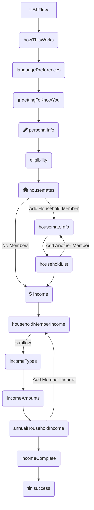

Table of Contents
=================
<!--
    **  This is not automatically generated. **
    Update this section when you update sections now.
    Please don't go more than three layers deep, so we can keep the TOC
    a reasonable size.
-->

* [Form Flow Concepts](#form-flow-concepts)
* [Defining Screens](#defining-screens)
    * [Using Thymeleaf](#using-thymeleaf)
        * [Icon reference](#icon-reference)
* [Defining Conditions](#defining-conditions)
    * [Using conditions in templates](#using-conditions-in-templates)
* [Defining Static Pages](#defining-static-pages)
* [Development setup](#development-setup)
    * [System Dependencies](#system-dependencies)
        * [Java Development Kit](#java-development-kit)
        * [Set up jenv to manage your jdk versions](#set-up-jenv-to-manage-your-jdk-versions)
        * [Gradle](#gradle)
    * [Start the local databases](#start-the-local-databases)
    * [Setup EnvFile in IntelliJ](#setup-envfile-in-intellij)
    * [Setup Application](#setup-application)
    * [Using a local version of the Form-Flow Library (For Form-Flow Library Developers):](#using-a-local-version-of-the-form-flow-library--for-form-flow-library-developers--)
        * [Terminal](#terminal)
        * [IntelliJ](#intellij)
    * [Setup Fake Filler (optional, Chrome &amp; Firefox):](#setup-fake-filler--optional-chrome--firefox--)
    * [Spring Profile: `dev`](#spring-profile-dev)
* [IntelliJ Setup](#intellij-setup)
  * [Connect Flows Config Schema](#connect-flows-config-schema)
  * [Applying Live Templates to your IntelliJ IDE](#applying-live-templates-to-your-intellij-ide)
  * [Using Live Templates](#using-live-templates)
  * [Contribute new Live Templates](#contribute-new-live-templates)

This is a standard Spring Boot application that uses the `form-flows` Java package as a library. It
can be customized to meet the needs of a web app, and is meant to be built upon. It's a plain,
boring (but modern) Spring app that uses common, frequently-used libraries throughout.

It contains example code for a simple, generic application for public benefits. An applicant
can fill out screens with their basic info, upload supporting documents, then submit it all.
Upon submission, they receive a simple SMS confirmation and a receipt email with a filled-in
application PDF. The entire experience is in both English and Spanish.

To power the form flow logic, this app depends on the `form-flows` Java library. That library is
included in `build.gradle` along with all other dependencies. The codebase for the `form-flows`
package is [open source](https://example.com) (TBD).

Out-of-the-box, integrations can be set up with common third-party services:

- Intercom
- Google Analytics
- Mixpanel
- Optimizely
- Google Ads
- Facebook Ads

The relevant service keys and other settings are configurable in `application.yaml`.

## Form Flow Concepts ##

A detailed explanation of form flow concepts can be found on in
the [form flow library's readme](https://github.com/codeforamerica/form-flow).

This chart below shows the flow created by the `flows-config.yaml` file in this repository.



## Defining Screens ##

All screens must have an entry in the flows-config in order to be rendered. Additionally, each
screen should have its own template defined in a folder respective to the flow that screen is
contained within. Example `/src/resources/templates/<flowName>/<templateName>`.

We have provided a number of IntelliJ Live templates to make the creation of screens faster and
easier. [More on Live Templates here](#applying-live-templates-to-your-intellij-ide).

When setting up a new flow, create a folder in `src/main/resources/templates` to hold all HTML
files. In the starter app, we name the respective template folders after their respective flows.

For example, add an HTML file such
as `about-you.html` [in the flow's templates folder](src/main/resources/templates). Here is an
example using our [live templates for a form screen](#applying-live-templates-to-your-intellij-ide):

```html

<th:block th:replace="'fragments/form' :: form(action=${formAction}, content=~{::formContent})">
  <th:block th:ref="formContent">
    <div class="form-card__content">
      <th:block th:replace="'icons' :: 'clipboard'"></th:block>
      <th:block th:replace="'content' :: cardHeader(header='Tell us about yourself')"/>
      <th:block
          th:replace="'inputs' :: textInput(name='firstName', label='What's your first name?')"/>
      <th:block
          th:replace="'inputs' :: textInput(name='lastName', label='What's your last name?')"/>
      <th:block
          th:replace="'inputs' :: textInput(name='emailAddress', label='What's your email address?')"/>
    </div>
    <div class="form-card__footer">
      <th:block th:replace="'fragments/continueButton' :: continue"/>
    </div>
  </th:block>
</th:block>
```

### Using Thymeleaf

We use Thymeleaf for frontend views. Thymeleaf is a Java based HTML framework for frontend
templating.
[You can learn more about Thymeleaf here.](https://www.thymeleaf.org/doc/tutorials/3.0/usingthymeleaf.html)

We use Thymeleaf's concept
of  [fragments](https://www.thymeleaf.org/doc/tutorials/3.0/usingthymeleaf.html#fragments) to store
complex mark up into simple reusable imports.

Fragments simplify the process of creating more complex HTML pages. Some places we use fragments
include input types, forms, page headers and footers, error handlers,
etc. [You can view these fragments
here.](src/main/resources/templates/fragments)

Thymeleaf is also capable of making direct calls to Java class methods using what is known as the
Spring Expression Language T operator. This allows you to implement Java code in your Thymeleaf
templates.
We provide two classes for this purpose:

- ConditionDefinitions
    - Houses methods which should always return Booleans and can be used to conditionally show or
      hide
      sections of a Thymeleaf template
- ViewUtilities
    - Houses methods for general purpose manipulation of data to display on the frontend in
      Thymeleaf templates

An example of using the T operator can be found in the `incomeAmounts` template from the starter
app.

```html

<main id="content" role="main" class="form-card spacing-above-35"
      th:with="selectedSelf=${T(org.codeforamerica.formflowstarter.app.config.ConditionDefinitions).incomeSelectedSelf(submission, uuid)},
                     houseHoldMemberName=${T(org.codeforamerica.formflowstarter.app.data.Submission).getSubflowEntryByUuid('income', uuid, submission).householdMember}">
  ...
</main>
```

#### Icon reference

If you need to see a reference of all icons from the form flow library, you can paste this fragment
import into your template to quickly see a preview and names of icons:

```
<th:block th:replace="fragments/icons :: icons-list"></th:block>
```

## Defining Conditions ##

Conditions are defined in Java as methods, and can read from the `currentSubmission` object. When
defining new conditions as methods, the instance variable `inputData` is accessible.

```java
public class ApplyConditions extends FlowConditions {

  public boolean isGmailUser() {
    return inputData.get('emailAddress').contains("gmail.com");
  }

} 
```

### Using conditions in templates

You can pull in conditions into a Thymeleaf with the T operator, then use the variable to define
show logic:

```html

<div
    th:with="showCondition=${T(org.codeforamerica.formflowstarter.app.config.ConditionDefinitions).<show-method>()}">
  <h1 th:if="showCondition">Conditionally show this element</h1>
</div>
```

## Defining Static Pages ##

Unlike Screens, Static Pages are HTML content not part of a flow. Examples include the home page,
privacy policy, or FAQ. This starter app contains a home page (`index.html`) and FAQ (`faq.html`)
as examples in the `resources/templates` folder.

To add a new Static Page:

1. Add an annotated method (`@GetMapping`) to the `StaticPageController`
2. Create a page template in `src/resources/templates`.

The template HTML can look like:

```html
<!DOCTYPE html>
<html th:lang="${#locale.language}">
<head th:replace="fragments/head :: head(title='')"></head>
<body>
<div class="page-wrapper">
  <th:block th:replace="fragments/toolbar :: toolbar"/>
  <th:block th:replace="fragments/demoBanner :: demoBanner"/>
  <section class="slab">
    <div class="grid">
      <div class="grid__item">
        <h1 class="spacing-below-35"></h1>
      </div>
    </div>
  </section>
  <main id="content" role="main" class="slab slab--white">

  </main>
</div>
<th:block th:replace="fragments/footer :: footer"/>
</body>
</html>
```

The IntelliJ Live Template for the above example can be generated with `cfa:staticPage`.

## Development setup ##

### System dependencies ###

_Note: these instructions are specific to macOS, but the same dependencies do need to be installed
on Windows as well._

#### Java Development Kit ####

If you do not already have Java 17 installed, we recommend doing this:

```
brew tap homebrew/cask-versions
brew install --cask temurin17
```

#### Set up jenv to manage your jdk versions ####

First run `brew install jenv`.

Add the following to your `~/.bashrc` or `~/.zshrc`:

```
export PATH="$HOME/.jenv/bin:$PATH"
eval "$(jenv init -)"
```

For m1 macs, if the above snippet doesn't work, try:

```
export PATH="$HOME/.jenv/bin:$PATH"
export JENV_ROOT="/opt/homebrew/Cellar/jenv/"
eval "$(/opt/homebrew/bin/brew shellenv)"
eval "$(jenv init -)"
```

Reload your terminal, then finally run this from the repo's root directory:

```
jenv add /Library/Java/JavaVirtualMachines/temurin-17.jdk/Contents/Home
```

#### Gradle ####

`brew install gradle`

### Start the local databases ###

- Install PostgreSQL 14 via an [official download](https://www.postgresql.org/download/)
    - Or on macOS, through homebrew: `brew install postgresql@14`

<!-- TODO: Is this the right way to create db/user? -->

- Create the database using the command line:
    - `$ createdb starter-app`
    - `$ createuser -s starter-app`

### Setup EnvFile in IntelliJ ###

We use a `.env` file to store secret, we use
the [EnvFile plugin](https://plugins.jetbrains.com/plugin/7861-envfile) to connect IntelliJ with
the `.env`.

- You will need to go [through their setup](https://plugins.jetbrains.com/plugin/7861-envfile).
- Follow EnvFile usage process [here](https://github.com/Ashald/EnvFile#usage) to setup Run
  Configurations with EnvFile.

### Setup Application  ###

- Use instructions from the [form-flow library here.](https://github.com/codeforamerica/form-flow#intellij-setup)
- Run the application using the `StarterApplication` configuration (found
  in `org.formflowstartertemplate.app`)

### Using a local version of the Form-Flow Library (For Form-Flow Library Developers): ###

To use the [form-flow](https://github.com/codeforamerica/form-flow) library locally:

1. Clone the form-flow repo in the same directory as the starter app. This line
   in [build.gradle](build.gradle) depends on it:
    ```
    implementation fileTree(dir: "$rootDir/../form-flow/lib/build/libs", include: '*.jar')
    ```
1. Ensure you build the jar.
1. Start the `form-flow-starter-app`.

#### Terminal ####

From the project root invoke
```./gradlew clean test```

#### IntelliJ ####

You can run tests directly in IntelliJ by running tests from test folder (via right click
or `ctrl + shift + r`).

### Setup Fake Filler (optional, Chrome & Firefox): ###

We use an automatic form filler to make manual test easier.

Install [Fake Filler for Chrome](https://chrome.google.com/webstore/detail/fake-filler/bnjjngeaknajbdcgpfkgnonkmififhfo)
or [Fake Filler for FireFox](https://addons.mozilla.org/en-US/firefox/addon/fake-filler/?utm_source=addons.mozilla.org&utm_medium=referral&utm_content=search)

- Go to [fakeFillerConfig.txt](fakeFillerConfig.txt), click on "Raw", then save the file to your
  computer.
- Open the Fake Filler Options then click
  on [Backup and Restore (chrome)](chrome-extension://bnjjngeaknajbdcgpfkgnonkmififhfo/options.html#/backup)
- Click on "Import Settings" and upload the config file that you saved above.
- Click
  on [Keyboard Shortcuts (chrome)](chrome-extension://bnjjngeaknajbdcgpfkgnonkmififhfo/options.html#/keyboard-shortcuts)
  to choose the shortcut you want to use to fill out the page.

### Spring Profile: `dev`

The Form Flow library has a `dev` Spring Profile that can be used by developers to
get more information from the library.

Please see
[Spring Profile: `dev`](https://github.com/codeforamerica/form-flow#spring-profile-dev)
for more information about what it provides and how to use this profile.

## IntelliJ Setup ##

### Connect flows config schema
We use [JSON schema](https://json-schema.org/understanding-json-schema/index.html) to autocomplete
and validate the `flows-config.yaml` file.

Follow the steps below in IntelliJ to connect the schema to your project's version of `flows-config.yaml`:

1. Download [`flows-config-schema.json` here.](intellij-settings/flows-config-schema.json)
1. Open IntelliJ preferences (`Cmd + ,` on mac)
1. Navigate to "JSON Schema Mappings"
1. Select the "+" in the top left to add a new mapping
1. Name can be anything (i.e. "Flow Config")
1. "Schema file or URL" needs to be set to the `flows-config-schema.json` file you just downloaded
1. "Schema version" set to "JSON Schema version 7"
1. Use the "+" under schema version to add:
    - a new file and connect to `src/main/resources/flows-config.yaml`
    - a folder and connect to `src/test/resources/flows-config`

To confirm that the connection is work, go into `flows-config.yaml` and see if autocomplete is
appearing for you.


### Applying Live Templates to your IntelliJ IDE ###

As a team, we use [IntelliJ](https://www.jetbrains.com/idea/) and can use
the [Live Templates](https://www.jetbrains.com/help/idea/using-live-templates.html) feature to
quickly build
Thymeleaf templates.

Support for importing/exporting these Live Templates is
a [buggy process](https://youtrack.jetbrains.com/issue/IDEA-184753) that can sometimes wipe away all
of your previous
settings. So we're going to use a copy/paste approach.

1. Open the [intellij-settings/LiveTemplates.xml](intellij-settings/LiveTemplates.xml) from the root
   of
   this repo
2. Copy the whole file
3. Open Preferences (`cmd + ,`), search or find the section "Live Templates"
4. If there isn't a template group already called CfA, create one by pressing the "+" in the top
   right area and selecting "Template group..."
5. Highlight the template group "CfA", right click and "Paste"
6. You should now see Live templates with the prefix "cfa:" populated in the template group

### Using Live Templates ###

Once you have Live Templates installed on your IntelliJ IDE, in (`.html`, `.java`) files you can use
our
Live Templates by typing `cfa:` and a list of templates to autofill will show itself.

### Contribute new Live Templates ###

1. Open Preferences (`cmd + ,`), search or find the section "Live Templates"
2. Find the Live Template you want to contribute
3. Right click and "Copy" (this will copy the Live Template in XML form)
4. Open [intellij-settings/LiveTemplates.xml](intellij-settings/LiveTemplates.xml) in this repo
5. Paste at the bottom of the file
6. Commit to GitHub
7. Now others can copy/paste your Live Templates
