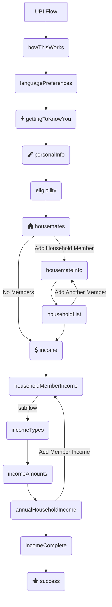

# Form Flow Starter Application

Table of Contents
=================
<!--
    **  This is not automatically generated. **
    Update this section when you update sections now.
    Please don't go more than three layers deep, so we can keep the TOC
    a reasonable size.
-->

* [Form Flow Starter Application](#form-flow-starter-application)
* [Table of Contents](#table-of-contents)
* [Universal Basic Income (UBI) Form Flow](#universal-basic-income-ubi-form-flow)
    * [Static Pages](#static-pages)
* [Development setup](#development-setup)
    * [System dependencies](#system-dependencies)
        * [Java Development Kit](#java-development-kit)
        * [Set up jenv to manage your jdk versions](#set-up-jenv-to-manage-your-jdk-versions)
        * [Gradle](#gradle)
        * [Start the local databases](#start-the-local-databases)
        * [Setup EnvFile in IntelliJ](#setup-envfile-in-intellij)
        * [Setup Application](#setup-application)
        * [Using a local version of the Form-Flow Library (For Form-Flow Library Developers)](#using-a-local-version-of-the-form-flow-library-for-form-flow-library-developers)
        

This is a standard Spring Boot application that uses the `form-flows` Java package as a library. It
can be customized to meet the needs of a web app, and is meant to be built upon. It's a plain,
boring (but modern) Spring app that uses common, frequently-used libraries throughout.

It contains example code for a simple, generic application for public benefits. An applicant
can fill out screens with their basic info, upload supporting documents, then submit it all.
Upon submission, they receive a simple SMS confirmation and a receipt email with a filled-in
application PDF. The entire experience is in both English and Spanish.

To power the form flow logic, this app depends on the `form-flows` Java library. That library is
included in `build.gradle` along with all other dependencies. The codebase for the `form-flows`
package is [open source](https://github.com/codeforamerica/form-flow).

A detailed explanation of form flow concepts can be found on in
the [form flow library's readme](https://github.com/codeforamerica/form-flow).

# Universal Basic Income (UBI) Form Flow

This chart below shows the flow created by the `flows-config.yaml` file in this repository.



## Static Pages

Unlike Screens, Static Pages are HTML content and are not part of a flow. Detailed information
about static pages can be found in
the [form-flow library documentation.](https://github.com/codeforamerica/form-flow#static-pages)

This application has three static pages served up by
the [StaticPageController](src/main/java/org/formflowstartertemplate/app/StaticPageController.java)
class:

* [index.html](src/main/resources/templates/index.hmtl)
* [faq.html](src/main/resources/templates/faq.html)
* [privacy.html](src/main/resources/templates/privacy.html)

# Setup instructions

## System dependencies

_Note: these instructions are specific to macOS, but the same dependencies do need to be installed
on Windows as well._

### Java Development Kit

If you do not already have Java 17 installed, we recommend doing this:

```
brew tap homebrew/cask-versions
brew install --cask temurin17
```

### Set up jenv to manage your jdk versions

First run `brew install jenv`.

Add the following to your `~/.bashrc` or `~/.zshrc`:

```
export PATH="$HOME/.jenv/bin:$PATH"
eval "$(jenv init -)"
```

For m1 macs, if the above snippet doesn't work, try:

```
export PATH="$HOME/.jenv/bin:$PATH"
export JENV_ROOT="/opt/homebrew/Cellar/jenv/"
eval "$(/opt/homebrew/bin/brew shellenv)"
eval "$(jenv init -)"
```

Reload your terminal, then finally run this from the repo's root directory:

```
jenv add /Library/Java/JavaVirtualMachines/temurin-17.jdk/Contents/Home
```

### Gradle

`brew install gradle`

### Start the local databases

- Install PostgreSQL 14 via an [official download](https://www.postgresql.org/download/)
    - Or on macOS, through homebrew: `brew install postgresql@14`

<!-- TODO: Is this the right way to create db/user? -->

- Create the database using the command line:
    - `$ createdb starter-app`
    - `$ createuser -s starter-app`

### Setup EnvFile in IntelliJ

We use a `.env` file to store secret, we use
the [EnvFile plugin](https://plugins.jetbrains.com/plugin/7861-envfile) to connect IntelliJ with
the `.env`.

- You will need to go [through their setup](https://plugins.jetbrains.com/plugin/7861-envfile).
- Follow EnvFile usage process [here](https://github.com/Ashald/EnvFile#usage) to setup Run
  Configurations with EnvFile.

### Setup Application

- Use instructions from
  the [form-flow library here.](https://github.com/codeforamerica/form-flow#intellij-setup)
- Run the application using the `StarterApplication` configuration (found
  in `org.formflowstartertemplate.app`)

### Using a local version of the Form-Flow Library (For Form-Flow Library Developers)

To use a local version of the  [form-flow](https://github.com/codeforamerica/form-flow) library you
can do the following:

1. Clone the `form-flow` repo in the same directory as the starter app.
1. Build the `form-flow` library jar.
1. In this starter app, set the `SPRING_PROFILES_ACTIVE`  to `dev` in
   the [`.env`](https://github.com/codeforamerica/form-flow-starter-app/blob/main/sample.env) file.
1. Start the `form-flow-starter-app`.

Changing the `SPRING_PROFILES_ACTIVE` to `dev` will cause the starter
app's [build.gradle](build.gradle) to pull in the local library, via this line:

 ```
 implementation fileTree(dir: "$rootDir/../form-flow/lib/build/libs", include: '*.jar')
 ```

# Using this as a template repository

TODO -- fill in how to start from this repository to create a new project
